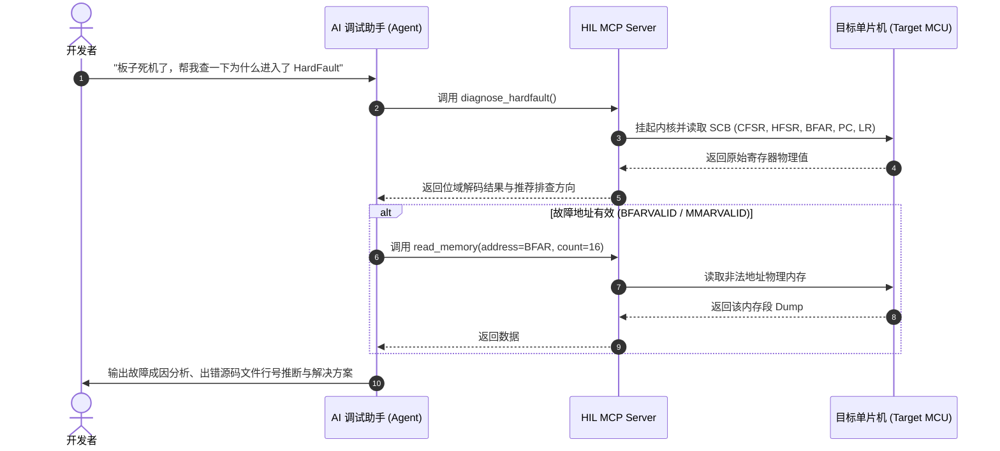

# Embedded HIL Debugger & Hardware MCP Skill

本 Skill 为 AI 助手提供针对 ARM Cortex-M 单片机硬件在环（Hardware-in-the-Loop, HIL）调试、固件烧录、寄存器级状态提取与硬故障（HardFault）根因分析的专业指引与标准操作规程。

通过连接至宿主机的 **DAPLink / CMSIS-DAP / J-Link** 调试器（均使用 PyOCD 引擎驱动），AI 助手可以直接通过 MCP 工具调用底层硬件物理接口，执行无侵入式的 SWD 调试与自动化测试。

---

## 1. 什么时候调用 MCP 工具 (When to Invoke MCP)

当用户提出以下类型的需求或场景时，AI 助手**应主动并按需调用对应的 MCP 工具**：

### 场景 1：目标单片机死机、崩溃或 HardFault 诊断
* **触发特征**：
  - 用户反馈：“板子跑着跑着死机了”、“进入了 HardFault_Handler”、“程序卡在死循环”、“串口打印乱码后停止响应”。
* **动作指引**：
  - **第 1 步**：调用 `diagnose_hardfault` 提取崩溃现场寄存器（`CFSR`, `HFSR`, `BFAR`, `MMFAR`, `PC`, `LR`）以及自动位域解码结论。
  - **第 2 步**：如需深入查看崩溃上下文的寄存器组（`R0-R12`, `MSP`, `PSP`），调用 `read_core_registers`。
  - **第 3 步**：如需查看发生非法访问的物理地址附近的数据，调用 `read_memory(address=..., count=64)`。

### 场景 2：固件烧录与自动化部署
* **触发特征**：
  - 用户反馈：“帮我把刚才编译生成的 `.bin`/`.hex`/`.elf` 烧到板子上”、“更新单片机固件”、“烧录测试包”。
* **动作指引**：
  - 检查固件路径有效性后，调用 `flash_firmware(file_path=...)`。
  - 烧录完成后，调用 `reset_target(halt=false)` 复位并引导芯片运行新固件。

### 场景 3：运行时外设寄存器与内存状态排查
* **触发特征**：
  - 用户反馈：“帮我看看 GPIOA 的状态”、“串口为什么没有输出”、“检查某个全局变量或 FreeRTOS 任务堆栈”、“DMA 搬运是否完成”。
* **动作指引**：
  - 根据芯片外设基地址（如 STM32F4 `GPIOA_ODR = 0x40020014`），调用 `read_memory(address=0x40020014, count=4)`。
  - 将读取到的十六进制物理数据按外设位域格式（Bitfield）为用户进行结构化解析。

### 场景 4：免编译在线动态调参 / 寄存器修改
* **触发特征**：
  - 用户反馈：“把这个寄存器改一下试试”、“把某个标志位置 1”、“修改某个 RAM 参数无需重新编译”。
* **动作指引**：
  - 调用 `write_memory(address=..., value=...)` 直接修改目标物理寄存器或 RAM 变量。

### 场景 5：硬件复位与时序控制
* **触发特征**：
  - 用户反馈：“重启一下板子”、“让板子停在第一条指令”、“把单片机挂起 (Halt)”。
* **动作指引**：
  - 正常运行复位：调用 `reset_target(halt=false)`。
  - 调试挂起复位：调用 `reset_target(halt=true)`，保持 CPU 处于暂停状态以便读取初始寄存器。

### 场景 6：探针连接探测与硬件环境确认
* **触发特征**：
  - 用户反馈：“现在连了哪个下载器”、“检测当前 DAPLink 状态”。
* **动作指引**：
  - 调用 `list_probes` 列出当前宿主机所有可见的调试器唯一标识（Unique ID）、厂商名称及产品型号。

---

## 2. MCP 工具详细参考与使用规范 (Tool Reference & Schema)

### 1. `list_probes`
* **功能**：探测并列出所有连接至电脑的 DAPLink / CMSIS-DAP / JLink 硬件探针。
* **参数**：无。
* **示例调用**：
  ```json
  {}
  ```
* **返回格式**：
  ```json
  [
    {
      "unique_id": "0d28:0204:6E197F26",
      "description": "INGCHIPS CMSIS-DAP",
      "vendor_name": "INGCHIPS",
      "product_name": "CMSIS-DAP"
    }
  ]
  ```

---

### 2. `read_core_registers`
* **功能**：实时拉取 CPU 核心通用寄存器与 SCB 系统控制块寄存器。
* **参数**：
  - `probe_id` *(string, 可选)*：指定探针 ID；
  - `target_override` *(string, 可选)*：目标芯片型号（例如 `"stm32f103c8"`、`"stm32f407vg"`）。
* **返回数据**：`r0` ~ `r12`, `sp`, `lr`, `pc`, `xpsr`, `msp`, `psp`, `cfsr`, `hfsr`, `dfsr`, `mmfar`, `bfar`。

---

### 3. `read_memory`
* **功能**：读取目标芯片指定内存地址的数据（支持 Flash、SRAM、外设寄存器映射区）。
* **参数**：
  - `address` *(integer | string, 必填)*：物理内存地址，如 `0x20000000` 或 `"0x40020014"`；
  - `count` *(integer, 默认 64)*：读取字节数（最大建议 4096）；
  - `probe_id` *(string, 可选)*；
  - `target_override` *(string, 可选)*。
* **返回数据**：起始地址、长度、HEX Dump 格式化字符串以及原始无符号字节数组。

---

### 4. `write_memory`
* **功能**：写入 32 位整型数值到目标芯片指定内存地址。
* **参数**：
  - `address` *(integer | string, 必填)*：32 位对齐的物理内存地址；
  - `value` *(integer | string, 必填)*：要写入的 32 位无符号整数；
  - `probe_id` *(string, 可选)*；
  - `target_override` *(string, 可选)*。
* **注意事项**：写外设寄存器前需确保该外设对应的总线时钟已开启，否则可能引发 Bus Fault。

---

### 5. `flash_firmware`
* **功能**：通过 SWD 协议将本地固件快速擦除并烧录至芯片 Flash。
* **参数**：
  - `file_path` *(string, 必填)*：固件文件（`.bin`, `.hex`, `.elf`）的绝对路径；
  - `target_override` *(string, 可选)*：芯片型号（如不提供则自动检测）；
  - `probe_id` *(string, 可选)*。
* **返回数据**：烧录耗时、烧录字节大小、操作状态。

---

### 6. `reset_target`
* **功能**：通过 SWD 硬件复位引脚 (nRESET) 或软件 SYSRESETREQ 复位目标单片机。
* **参数**：
  - `halt` *(boolean, 默认 false)*：`true` 表示复位后立即挂起内核，`false` 表示复位后正常运行；
  - `probe_id` *(string, 可选)*；
  - `target_override` *(string, 可选)*。

---

### 7. `diagnose_hardfault`
* **功能**：**【核心诊断工具】** 自动挂起目标、提取 Cortex-M 异常堆栈与 SCB 寄存器，并完成精确的位域分析（CFSR/HFSR）。
* **参数**：
  - `probe_id` *(string, 可选)*；
  - `target_override` *(string, 可选)*。
* **位域诊断能力**：
  - **MemManage (MMFSR)**：`IACCVIOL` (指令越权), `DACCVIOL` (数据访问越权), `MMARVALID` (记录故障地址)。
  - **BusFault (BFSR)**：`PRECISERR` (精确总线错误), `IMPRECISERR` (非精确总线错误), `BFARVALID` (记录导致总线错误的非法访问地址)。
  - **UsageFault (UFSR)**：`UNDEFINSTR` (未定义指令), `INVSTATE` (非法 Thumb 状态), `UNALIGNED` (未对齐访问), `NOCP` (未开启浮点 FPU 协处理器)。
  - **HardFault (HFSR)**：`FORCED` (可配置错误升级为硬错误), `VECTTBL` (向量表读取失败)。

---

## 3. 标准 AI 协同排错工作流 (Standard Workflows)

### 工作流 A：单片机 HardFault 智能排障全流程



#### AI 诊断建议输出模版：
1. **崩溃类型判定**：明确指出是总线错误 (BusFault)、内存访问越权 (MemManage) 还是非法状态 (UsageFault)；
2. **发生崩溃的代码位置**：结合 `PC` 寄存器值（如 `PC=0x08001F4C`）定位具体函数；
3. **关键物理地址**：若 `BFARVALID` 置 1，指出引起错误的物理内存地址（如 `0x40021000`）；
4. **根因归纳与排查清单**：
   - 是否存在空指针解引用（如 `ptr->data`，而 `ptr == NULL`）；
   - 是否访问了未使能时钟的外设寄存器；
   - 是否在中断服务程序中使用了 `float` 运算但未使能 FPU (`SCB->CPACR`)；
   - 是否堆栈溢出（检查 `SP` 是否超出 RAM 边界）。

---

## 4. 安全防护与最佳实践 (Safety Guidelines)

1. **写内存前二次校验**：
   - 在调用 `write_memory` 时，严禁随意向芯片 Flash 映射区（如 `0x08000000`）写入普通数据（Flash 写入必须按页擦除并遵循特定解锁时序，应使用 `flash_firmware` 工具）。
2. **地址 32 位对齐规范**：
   - 绝大多数 Cortex-M 外设寄存器要求严格的 4 字节（32-bit）对齐，访问地址的末两位十六进制必须为 `0`, `4`, `8`, `C`。
3. **总线时钟依赖意识**：
   - 调试外设（如 USART、SPI、I2C、CAN）前，如果读取到的寄存器全是 `0x00000000` 或直接触发 `PRECISERR`，首先应检查对应 RCC 时钟使能寄存器。
4. **低功耗唤醒机制**：
   - 如果单片机进入了 `WFI` (Wait For Interrupt) 或 `Standby` 深度睡眠模式，SWD 调试引脚可能会被关闭。此时可在复位引脚保持拉低时调用 `reset_target(halt=true)` 进行连线。
