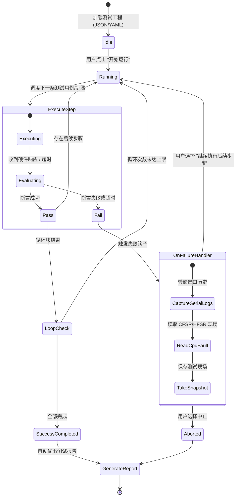

# 自动化 HIL 脚本流编排器 (Automated HIL Test Sequencer & Pipeline) 详细设计方案

## 1. 方案背景与目标

硬件在环测试（Hardware-in-the-Loop, HIL）的核心价值在于**闭环、无人值守、高重复性的自动化验证**。
在现实嵌入式产品交付中，工程师面临大量重复繁重的回归与压力测试任务：
1. **固件发布回归测试**：每次编译新代码，需手动烧录、复位单片机、发送几条 AT 指令查看返回值、用万用表或 SWD 看内存是否符合预期。
2. **长时间老化与稳定性压测**：例如设备需连续运行 72 小时、频繁断电重启 2000 次、并发收发 100,000 包，目前缺乏开箱即用的本地自动化执行流引擎。
3. **测试数据难以追溯**：测试出 Bug 后的现场上下文（如串口崩溃日志、死机时 PC 寄存器、HardFault 信息）未能在失败瞬间自动抓取。

### 核心目标
- **无代码 / 低代码可视编排 (Visual Test Sequencer)**：无需编写复杂的 Python 或脚本代码，用户在 UI 上像拼积木一样组合测试步骤。
- **全要素 HIL 控制闭环**：能够统一调度目前工具已有的所有硬件能力（DAPLink SWD 寄存器与内存读写、固件烧录、串口命令收发、DTR/RTS 引脚脉冲复位、延时等待）。
- **断言与自动化校验 (Assert Engine)**：支持“文本匹配断言”、“正则表达式断言”、“内存值比较断言”、“寄存器标志位断言”。
- **失败自愈与现场存证 (Failure Snapshot & AI Root-Cause)**：某步骤失败时，自动保存近 500 条串口日志与当前 CPU 寄存器，并可一键呼叫 AI 进行现场根因分析。
- **自动化测试报告生成**：测试完成后，一键导出详细的 HTML / PDF / JSON 自动化测试报告。

---

## 2. 编排动作库与能力矩阵

自动化流水线支持编排的基础原子操作（Steps）：

| 动作类型 (Action) | 参数配置 (Parameters) | 成功判定 / 断言条件 (Assertions) |
| :--- | :--- | :--- |
| **`flash_firmware`** | 固件文件路径 (`.bin`/`.hex`/`.ini`)、烧录波特率、模式 | 烧录进度 100%，烧录器返回 Success |
| **`reset_target`** | 复位方式（`swd_soft_reset`, `pin_dtr_pulse`, `daplink_reset`）、低电平保持时间 (ms) | 复位执行完成 |
| **`serial_send`** | 发送文本/HEX 字节、换行符结尾 (`CRLF`/`LF`/`None`)、目标端口 | 串口写入成功 |
| **`serial_wait_match`** | 匹配模式（`contains` / `regex`）、关键字、超时时间 (ms) | 超时时间内收到包含预期文本的串口数据包 |
| **`swd_read_assert`** | 目标物理地址 (如 `0x20000000`)、数据宽度 (8/16/32-bit)、期望值、比对操作符 (`==`, `!=`, `>`, `<`) | 读出值满足比对条件 |
| **`svd_check_reg`** | 外设名 (如 `UART0`)、寄存器名 (`LSR`)、位字段 (`TEMT`)、期望状态 | 外设寄存器标志位满足期望 |
| **`delay`** | 延时时间 (毫秒/秒) | 倒计时结束 |
| **`loop_block`** | 循环体开始/结束、循环次数或持续时间 | 循环内所有用例执行完毕 |

---

## 3. 系统架构与执行状态机



---

## 4. UI 界面与交互设计

### 4.1 测试流水线编辑器 (Pipeline Canvas)
- **左侧：动作库面板 (Action Palette)**：展示各类动作卡片（烧录、串口收发、复位、内存检查等），支持拖拽或点击添加至右侧执行流。
- **中间：流程树与步骤卡片 (Step Sequencer)**：
  - 每个步骤卡片清晰展示：序号、动作类型、核心参数预览、超时时间、失败行为（`停止执行` / `忽略继续` / `重试 N 次`）；
  - 支持拖拽调换步骤前后顺序；
  - 支持“一键禁用/启用”单个测试步骤（类似 Postman / JMeter）。
- **执行状态实时高亮**：
  - 当前正在运行的步骤：蓝色边框带旋转加载动画；
  - 成功步骤：绿色打勾图标，显示实际消耗时间（例如 `45ms`）；
  - 失败步骤：红色高亮，直接弹出错误差异信息（例如 `预期包含 "System Boot OK"，实际收到 "Watchdog Reset!"`）。

### 4.2 实时监控与多端日志联动
- 执行过程中，底部抽屉可实时切换查看：
  - **Runner Log**：测试引擎本身的调度调度日志；
  - **Device Console**：关联串口的原始实时输入输出；
  - **Memory Snapshot**：断言时读出的芯片物理内存 Dump。

### 4.3 自动化测试报告 (Test Report)
- 测试完毕后一键弹出独立预览窗口，包含：
  - **指标概览**：总耗时、总用例数、Pass 数量、Fail 数量、成功率百分比；
  - **时间线视图 (Timeline)**：展示每个步骤执行消耗时间的甘特图；
  - **失败原因归档**：带时间戳的错误堆栈、失败时刻的串口截图与寄存器状态；
  - **导出按钮**：支持一键导出包含样式的美观自包含单页 HTML 文件，或用于 CI/CD 流水线的 `junit.xml` 报告。

---

## 5. 工程文件格式定义 (.hiltest)

测试流程支持保存为独立的 `.json` 或 `.yaml` 工程文件，支持团队共享与版本管理：

```json
{
  "name": "BLE固件烧录与开机自检回归用例",
  "version": "1.0",
  "loop_count": 1,
  "stop_on_error": true,
  "steps": [
    {
      "id": "step_1",
      "name": "硬件引脚拉低复位",
      "action": "reset_target",
      "params": {
        "method": "pin_dtr_pulse",
        "pulse_ms": 50
      }
    },
    {
      "id": "step_2",
      "name": "擦除并烧录最新固件",
      "action": "flash_firmware",
      "params": {
        "file_path": "C:/firmware/app.hex",
        "baud": 921600
      },
      "timeout_ms": 10000
    },
    {
      "id": "step_3",
      "name": "等待系统初始化完成提示",
      "action": "serial_wait_match",
      "params": {
        "port": "COM3",
        "match_type": "contains",
        "pattern": "System Boot Ready"
      },
      "timeout_ms": 3000
    },
    {
      "id": "step_4",
      "name": "校验内存全局标志位状态",
      "action": "swd_read_assert",
      "params": {
        "address": "0x20000100",
        "width": 32,
        "operator": "==",
        "expected_value": "0x55AA0001"
      }
    }
  ]
}
```

---

## 6. MCP 与 AI 深度联动

- **自然语言用例生成**：用户在 AI 侧输入：“*请帮我生成一个测试脚本，反复给板子断电 100 次，每次启动检查是否有 HardFault*”，AI 自动生成 `.hiltest` 配置并导入编排器。
- **失败原因自动化专家诊断**：当某个用例失败时，流水线自动触发 `diagnose_pipeline_failure` 工具，将失败时刻的上下文一并传给 AI，AI 直接向用户输出修复代码建议。
